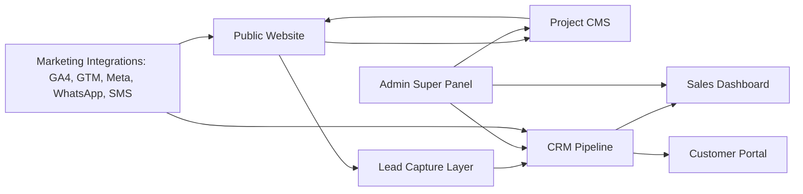
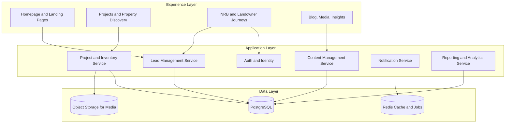
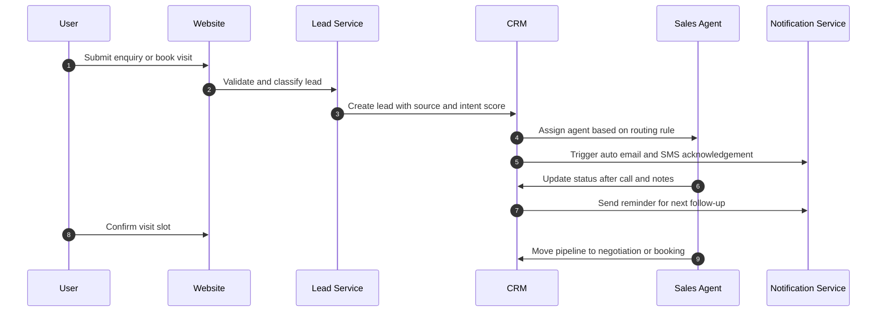
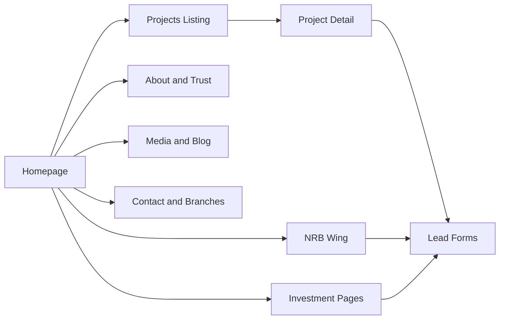
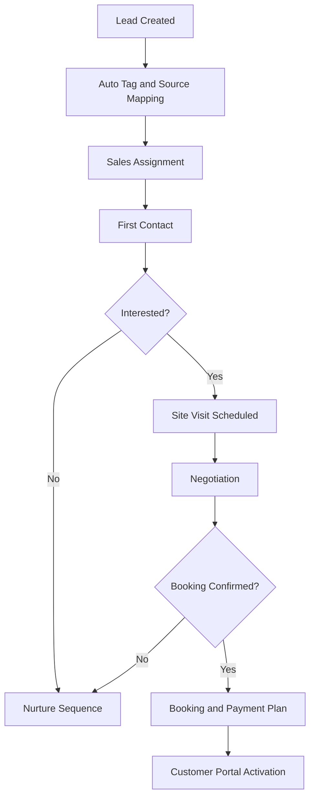
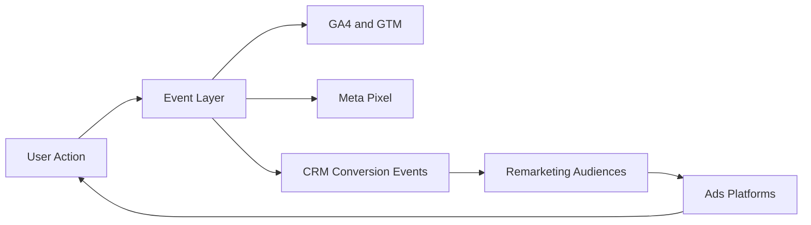
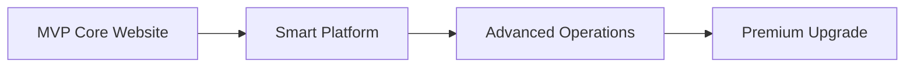
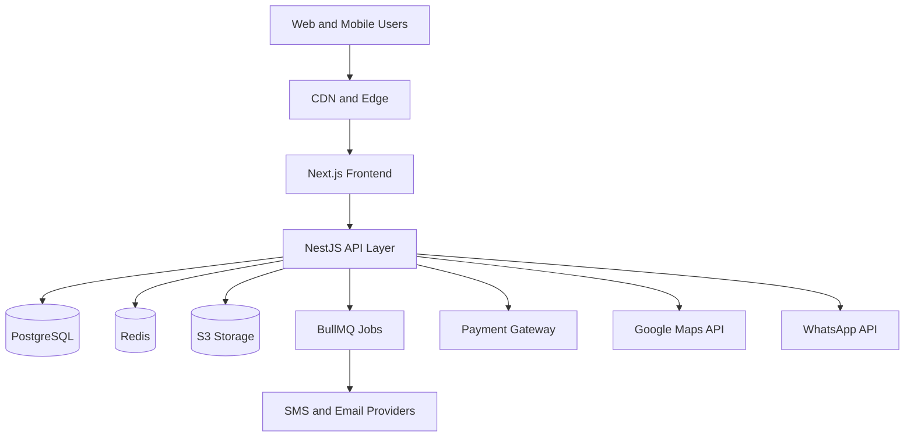

# ADVANCE LANDMARK LIMITED

**Chairman:** ফাহাদ হোসেন (Fahad Hossain)  
**Address:** Plot: 268, Road: 12, Savar DOHS, Savar, Dhaka  
**Phone:** 01711729009

## Document Control

| Field | Value |
|---|---|
| Document Title | Enterprise Real Estate Digital Platform Ecosystem - Master Scope Bible |
| Version | 1.1 |
| Date | April 2026 |
| Confidentiality | Confidential |
| Prepared For | Advance Landmark Limited |
| Prepared For (Attention) | Chairman, Fahad Hossain |
| Purpose | Single master scope for development, operations, and full technical support services |

## 1. Executive Summary

Advance Landmark Limited requires a full digital ecosystem, not only a public website. This master scope defines a production-grade platform that covers brand positioning, project discovery, CRM pipeline management, customer self-service, sales operations, analytics, and post-launch growth support.

This document combines two major tracks under one implementation framework:

1. Platform Engineering Track (website, CRM, CMS, dashboard, portal, integrations).
2. Technical Growth Track (graphics, video, SEO, social, content, paid media).

### 1.1 Strategic Positioning

**Positioning Statement:** Premium, trustworthy, investment-focused real estate developer.

### 1.2 Strategic Outcomes

1. Improve trust conversion through transparent project detail, certifications, and corporate credibility.
2. Improve lead quality through segmented funnels and role-based follow-up process.
3. Improve close rate through CRM pipeline, sales visibility, and customer communication tools.
4. Build recurring growth through integrated SEO, content, social media, and paid campaigns.

## 2. Industry Analysis and Competitive Signals

### 2.1 Market Patterns Observed in Bangladesh Real Estate Websites

Core references: Assure Group, Swadesh, BTI, Sheltech, Shanta, Navana and similar market leaders.

| Pattern Area | What Top Players Do | Why It Matters for Advance Landmark |
|---|---|---|
| Trust-first branding | Chairman message, certifications, timeline, legacy | Converts cautious buyers and investors |
| Project-centric architecture | Ongoing, upcoming, completed with deep details | Improves project-level lead quality |
| Investment messaging | ROI, location growth, long-term value story | Attracts investor audience, NRB, and commercial buyers |
| Lead-heavy UX | Book visit, callback, WhatsApp, quick forms | Reduces drop-off and improves enquiry volume |
| Lifestyle storytelling | Better living, premium lifestyle, community | Strengthens emotional decision-making |

### 2.2 Benchmark Feature Matrix

| Feature/Module | BTI | SHL | SHA | ASS | NAV | SWD | RNG | NWP |
|---|---|---|---|---|---|---|---|---|
| Residential Listings | Yes | Yes | Yes | Yes | Yes | Yes | Yes | Yes |
| Commercial Listings | Yes | Yes | No | Yes | Yes | Yes | Yes | Yes |
| Land/Plot Sales | No | Yes | No | No | Yes | No | No | Yes |
| Advanced Search Filter | Yes | Yes | No | Yes | Yes | Yes | Yes | Yes |
| Interactive Map | Yes | Yes | No | No | No | No | No | No |
| Construction Tracker | Yes | No | No | No | No | No | No | No |
| Landowner/JV Section | Yes | Yes | No | Yes | Yes | Yes | Yes | Yes |
| NRB Section | Yes | No | No | No | Yes | No | No | No |
| Testimonials/Reviews | Yes | Yes | No | Yes | No | Yes | No | No |
| Blog/Media | Yes | Yes | Yes | Yes | Yes | Yes | No | No |
| Career Module | Yes | Yes | Yes | Yes | Yes | No | No | Yes |
| WhatsApp/Hotline CTA | Yes | Yes | No | Yes | Yes | Yes | Yes | Yes |

### 2.3 Critical Success Factors

1. Trust before design polish.
2. Location storytelling before generic feature listing.
3. Lead capture optimized on every high-intent page.
4. Mobile-first execution because majority traffic is mobile-led.

## 3. Master System Architecture (Ecosystem)

This scope is designed as an integrated Real Estate Digital Platform Ecosystem with six connected systems.

1. Marketing Website (Public).
2. CRM and Lead Management System.
3. Project and Content CMS.
4. Sales Dashboard (Internal).
5. Customer Portal (Buyer and Landowner side).
6. Admin Super Panel.

### 3.1 Ecosystem Architecture Flowchart

### 3.2 System Design View (Logical Components)

### 3.3 Lead Journey Sequence Diagram

## 4. Scope Architecture by Domain

| Domain | Area | Summary |
|---|---|---|
| Domain A | Public Website Frontend | Brand, discovery, trust, and conversion experience |
| Domain B | Customer Portal | Buyer and landowner authenticated self-service |
| Domain C | Admin, CMS, CRM, Sales Ops | Core internal control and pipeline engine |
| Domain D | Marketing and Channel Integration | SEO, analytics, social, remarketing connectivity |
| Domain E | Integrated Technical Support Services | Graphics, video, SEO operations, social, content, paid ads |
| Domain F | Post-Launch Operations | SLA, optimization, governance, and continuous improvements |

## 5. Domain A - Public Website Detailed Feature Breakdown

### 5.1 A1 Homepage and Conversion Engine

**Objective:** Create trust and drive enquiry from first screen.

**Feature Breakdown:**
1. Hero with image/video/3D render option.
2. Primary CTA cluster: Explore Projects, Book Consultation, WhatsApp.
3. Trust strip: years, completed projects, clients served, approvals.
4. Featured projects carousel with quick specs.
5. Chairman message and testimonial summary.
6. Quick enquiry widget and click-to-call.

**Data Inputs:** Hero assets, project highlights, trust KPIs, chairman statement.  
**Outputs:** High-intent enquiries, lower bounce rate.

### 5.2 A2 About and Corporate Trust Module

**Objective:** Establish company credibility and long-term confidence.

**Feature Breakdown:**
1. Company profile and milestone timeline.
2. Vision and mission narrative.
3. Chairman message section.
4. Certifications and affiliations (REHAB, RAJUK, ISO where available).
5. Group companies and partner logos.

**Data Inputs:** Corporate profile, legal and compliance assets.  
**Outputs:** Trust uplift and conversion support.

### 5.3 A3 Projects Module (Core Engine)

**Objective:** Serve as the central property discovery and conversion layer.

**Feature Breakdown:**
1. Project categories: ongoing, upcoming, completed.
2. Smart filters: location, budget, type, size, status.
3. Fast search with sort and listing mode options.
4. Listing card with status badge and quick CTA.

**Project Detail Page (Critical):**
1. Overview, gallery, floor plans, amenities.
2. Unit size and configuration details.
3. Google Map and nearby facilities context.
4. Download brochure and request callback.
5. CTA actions: book visit and speak to sales.

**Data Inputs:** Project metadata, media, location, availability.  
**Outputs:** Project-specific leads and visit bookings.

### 5.4 A4 Property Types and Collections

**Objective:** Segment demand and improve user journey relevance.

**Supported Types:**
1. Residential.
2. Commercial.
3. Land/Plot.
4. Township.

**Data Inputs:** Tagged project inventory.  
**Outputs:** Faster route to matching projects.

### 5.5 A5 Investment Insights Module

**Objective:** Convert investor intent with value-driven storytelling.

**Feature Breakdown:**
1. ROI narratives and location growth thesis.
2. Area development and infrastructure trends.
3. Investment knowledge posts and calculators.
4. Strategic project positioning for long-term returns.

### 5.6 A6 Customer Journey and Process Pages

**Objective:** Reduce buyer uncertainty with transparent process guidance.

**Feature Breakdown:**
1. Buying process and booking process map.
2. Payment plan examples and financing overview.
3. Legal support checklist and documentation guidance.
4. FAQ for first-time buyer confidence.

### 5.7 A7 NRB Module (Global Buyer Wing)

**Objective:** Enable remote purchase journey for international clients.

**Feature Breakdown:**
1. Buy-from-abroad workflow.
2. Virtual consultation and remote booking flow.
3. Currency and payment support information.
4. Dedicated NRB enquiry and callback lane.

### 5.8 A8 Blog, Media, and News Center

**Objective:** Build authority, SEO visibility, and repeat engagement.

**Feature Breakdown:**
1. Blog categories for buyers, investors, legal updates.
2. Project update stories and launch announcements.
3. Market trend analysis and insight content.
4. Share-ready article templates.

### 5.9 A9 Contact and Branch Network

**Objective:** Offer frictionless multi-channel contact access.

**Feature Breakdown:**
1. Office locations and map embeds.
2. Hotline and WhatsApp deep links.
3. Department-wise enquiry routing.
4. Callback request forms and branch-wise contact cards.

### 5.10 A10 Advanced UX and Conversion Enhancers

**Objective:** Improve conversion through premium usability patterns.

**Feature Breakdown:**
1. Sticky enquiry and floating WhatsApp buttons.
2. Smart filters and high-speed listing interactions.
3. Lazy loading and media optimization.
4. Smooth animation and mobile-first interaction patterns.

### 5.11 Domain A Module Dependency Diagram

## 6. Domain B - Lead Generation and Customer Portal Breakdown

### 6.1 Lead Generation System (Critical)

**Entry Points:**
1. Contact forms.
2. Book visit forms.
3. Download brochure forms.
4. WhatsApp CTA and click-to-call.

**Core Features:**
1. Lead tagging (Hot, Warm, Cold).
2. Auto acknowledgement through email/SMS.
3. Source tagging (organic, social, paid, referral).
4. Duplicate detection and dedupe workflow.

### 6.2 Customer Portal (Advanced)

**Capabilities:**
1. Login dashboard and profile control.
2. Booking status and visit history.
3. Payment history and installment tracking.
4. Document center for agreements and receipts.
5. Support tickets and communication log.

## 7. Domain C - CRM, Admin Panel, Sales and Inventory Breakdown

### 7.1 CRM System (Internal)

**Pipeline:** Inquiry -> Visit -> Negotiation -> Booking -> Closed.

**Feature Breakdown:**
1. Lead dashboard with filter and assignment controls.
2. Agent assignment by project, zone, and workload.
3. Follow-up reminders and task scheduler.
4. Notes and activity timeline per lead.
5. Stage conversion analytics.

### 7.2 Admin Super Panel

**Feature Breakdown:**
1. Project management and publishing controls.
2. Unit inventory and pricing control.
3. Blog CMS and media library.
4. Lead management queue and pipeline governance.
5. User roles: admin, sales, marketing, support.

### 7.3 Sales and Inventory System

**Feature Breakdown:**
1. Real-time unit availability.
2. Temporary booking lock to prevent double booking.
3. Price variation logic by floor, view, and unit type.
4. Discount and approval workflow.

### 7.4 CRM and Sales Workflow Diagram

## 8. Domain D - Marketing and Digital Integration Breakdown

### 8.1 SEO and Organic Growth

**Technical SEO:**
1. Structured data and schema models.
2. Canonical, sitemap, robots, hreflang.
3. Core Web Vitals and page speed optimization.

**On-Page SEO:**
1. Page title and metadata strategy.
2. Internal linking and semantic heading structure.
3. Project and location landing page optimization.

**Off-Page SEO:**
1. Authority-building outreach and backlinks.
2. Local business profile optimization.
3. Monthly performance and ranking report.

### 8.2 Social and Remarketing Integrations

1. GA4, GTM, Meta Pixel, optional TikTok pixel.
2. WhatsApp API and SMS gateway integrations.
3. Email automation and nurture sequences.
4. Conversion event tracking and remarketing audience setup.

### 8.3 Marketing Data Flow Diagram

## 9. Domain E - Integrated Technical Support Services (Detailed)

### 9.1 Service Coverage Matrix

| Service Area | Scope | Core Deliverables | Frequency | KPI Focus |
|---|---|---|---|---|
| Graphics Design | Brand and campaign creative pipeline | Social creatives, ad banners, brochure assets, landing visuals | Weekly/Monthly | Creative output and campaign consistency |
| Video Editing and Motion | Branded video and ad asset production | Reel edits, testimonial edits, subtitles, ad cutdowns | Weekly/Monthly | Engagement rate and watch completion |
| SEO Operations | Technical plus content-led ranking growth | Audit, optimization, off-page plan, local SEO, reporting | Monthly | Organic traffic and qualified lead volume |
| Social Media Management | Channel execution and audience growth | Calendar, publishing, moderation, monthly insights | Weekly/Monthly | Reach, engagement, inbound enquiries |
| Content and Copywriting | Conversion and authority content | Website copy, blog content, ad copy, bilingual adaptation | Weekly/Monthly | CTR, dwell time, conversion assist |
| Paid Ads Management | Lead generation and cost optimization | Campaign setup, testing, optimization, reporting | Daily/Weekly/Monthly | Cost per lead, lead quality, ROI |

### 9.2 Service Operating Model

1. Monthly planning sprint.
2. Weekly production and optimization cycles.
3. Mid-month performance review.
4. End-month reporting and next-month action plan.

### 9.3 Service Delivery Sequence

## 10. Domain F - Post-Launch Operations and SLA

### 10.1 SLA Matrix

| Priority | Example Incident | Response SLA | Included Period |
|---|---|---|---|
| P1 Critical | Site down, major security event | Under 2 hours | 12 months |
| P2 High | Core feature unavailable, CMS outage | Under 8 hours | 12 months |
| P3 Medium | Functional bug, slow page group | Under 24 hours | 12 months |
| P4 Low | Improvement request or non-urgent update | Under 72 hours | 12 months |

### 10.2 Monthly Retainer Activities

1. Security updates and dependency patching.
2. Performance audits and optimization backlog.
3. SEO and keyword performance reporting.
4. Content and campaign support operations.
5. Infrastructure monitoring, backup and uptime checks.

## 11. Phase-Wise Execution Roadmap

| Phase | Name | Duration | Primary Goal | Key Deliverables |
|---|---|---|---|---|
| P1 | MVP Core Website | 8-10 weeks | Launch fast and start lead generation | Homepage, About, Projects listing and detail, Contact, lead forms |
| P2 | Smart Platform | 5-6 weeks | Build operational intelligence | CRM, Admin panel, lead tracking, blog CMS |
| P3 | Advanced Operations | 6-8 weeks | Add customer and sales depth | Customer portal, inventory system, payment tracking |
| P4 | Premium Upgrade | 6-8 weeks | Differentiate experience and automation | 3D tours, virtual site visit, chatbot, advanced analytics |

### 11.1 Phase Dependency Flow

## 12. Recommended Technical Architecture Stack

### 12.1 Core Stack

| Layer | Recommended Stack |
|---|---|
| Frontend | Next.js, React |
| Backend | Node.js, NestJS or Express |
| Database | PostgreSQL or MongoDB |
| Storage | AWS S3 or MinIO |
| Cache and Jobs | Redis plus BullMQ |
| Authentication | JWT plus OTP |
| Payments | SSLCommerz, bKash (if enabled) |
| SMS | Local BD gateway (client-provided if required) |
| Hosting | Vercel (frontend), AWS or DigitalOcean (backend) |
| CI/CD | GitHub Actions |
| Monitoring | Prometheus, Grafana, CloudWatch |
| Logging | ELK stack or CloudWatch Logs |

### 12.2 Deployment Architecture View

## 13. Governance, Roles, and Responsibilities

### 13.1 Delivery Model

1. Agile sprints with weekly review and monthly steering report.
2. UAT gate before phase release.
3. Change request process for out-of-scope items.

### 13.2 Responsibility Matrix (RACI Snapshot)

| Workstream | Delivery Team | Client SPOC | Chairman Office |
|---|---|---|---|
| Scope implementation | Responsible | Consulted | Informed |
| Content and brand approvals | Consulted | Responsible | Accountable |
| UAT and go-live sign-off | Consulted | Responsible | Accountable |
| Monthly growth plan | Responsible | Consulted | Informed |

## 14. Scope Clarification

### 14.1 Included

1. End-to-end digital platform ecosystem implementation.
2. CRM, admin controls, customer portal, and analytics foundation.
3. Integrated technical support services for growth operations.
4. Post-launch support and SLA-backed maintenance.

### 14.2 Excluded Unless Approved by Change Request

1. Third-party paid media budget.
2. Legal or tax advisory work outside software process support.
3. New enterprise modules not listed in this master scope.

## 15. Appendix

### 15.1 Module Volume Summary

| Domain | Description | Module Count |
|---|---|---|
| Domain A | Public Website Detailed Modules | 10 |
| Domain B | Lead and Customer Portal Modules | 2 |
| Domain C | CRM, Admin, Sales and Inventory Modules | 3 |
| Domain D | Marketing and Integration Modules | 2 |
| Domain E | Technical Support Service Modules | 6 |
| Domain F | Post-Launch and SLA Modules | 2 |
| Total | Unified Ecosystem | 25 |

### 15.2 Sign-Off Block

| Role | Name | Date | Signature |
|---|---|---|---|
| Client Representative |  |  |  |
| Chairman |  |  |  |
| Delivery Partner |  |  |  |

---

**ADVANCE LANDMARK LIMITED - MASTER SCOPE BIBLE v1.1 (April 2026) - CONFIDENTIAL**  
Prepared exclusively for Fahad Hossain, Chairman, Advance Landmark Limited.
