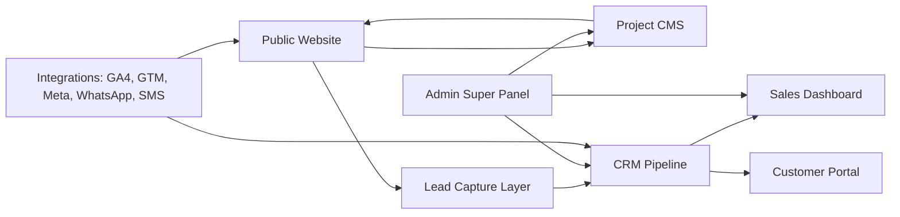
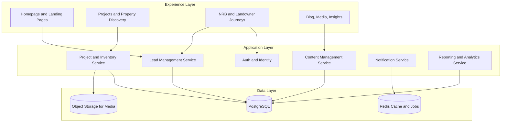
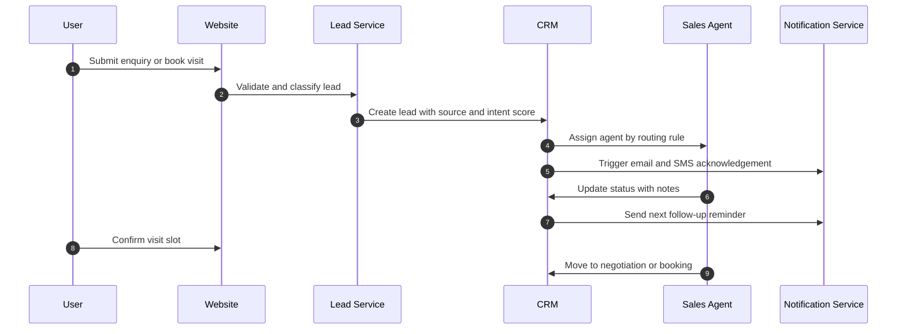
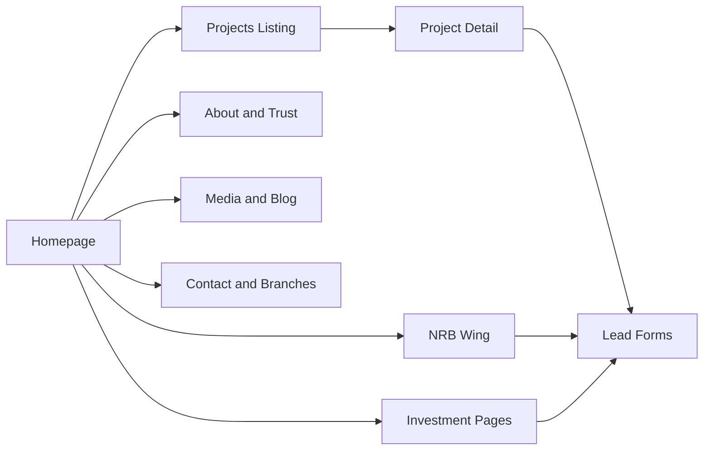
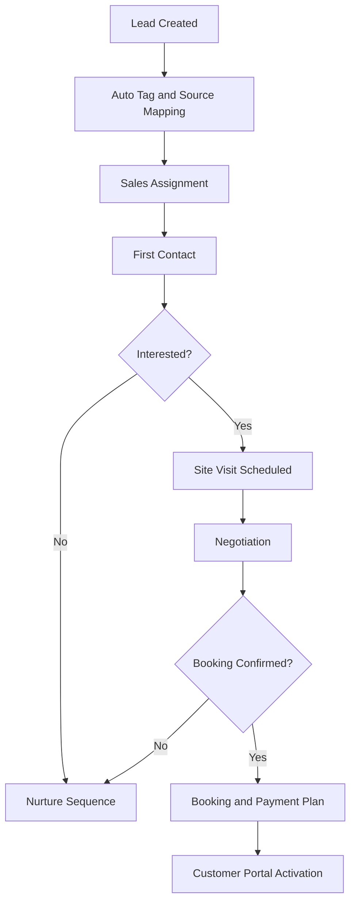
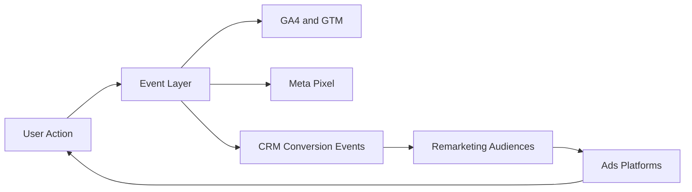
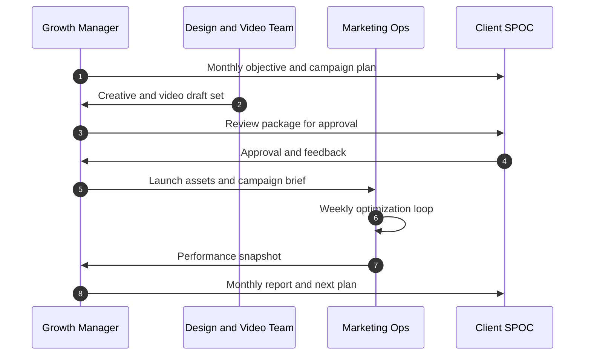
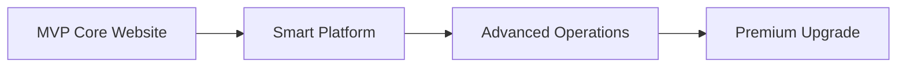
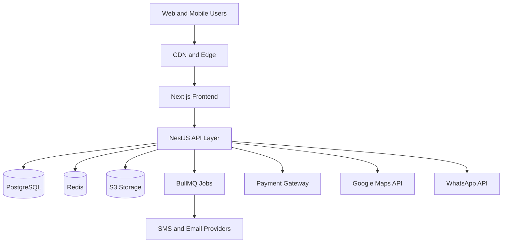

# ADVANCE LANDMARK LIMITED

## Enterprise Real Estate Digital Platform Ecosystem
### Master Scope Bible

**Version:** 2.0 (Restructured Client Edition)  
**Date:** April 2026  
**Confidentiality:** Confidential  
**Prepared For:** Advance Landmark Limited  
**Attention:** Chairman, Fahad Hossain  

---

## Cover Page

**Client Organization**  
Advance Landmark Limited

**Chairman**  
ফাহাদ হোসেন (Fahad Hossain)

**Registered Address**  
Plot: 268, Road: 12, Savar DOHS, Savar, Dhaka

**Contact Number**  
01711729009

**Document Purpose**  
Single master scope for product development, growth operations, and SLA-backed technical support.

---

## Document Control

| Field | Value |
|---|---|
| Document Title | Enterprise Real Estate Digital Platform Ecosystem - Master Scope Bible |
| Version | 2.0 (Restructured) |
| Date | April 2026 |
| Owner | Advance Landmark Limited |
| Prepared For | Chairman Office |
| Scope Type | End-to-end platform and growth operations |
| Validity | Subject to approved change requests |

---

## Table of Contents

1. Executive Summary  
2. Industry Analysis and Competitive Signals  
3. Master System Architecture  
4. Scope by Domain  
5. Domain A: Public Website  
6. Domain B: Lead Generation and Customer Portal  
7. Domain C: CRM, Admin, Sales and Inventory  
8. Domain D: Marketing and Channel Integration  
9. Domain E: Integrated Technical Support Services  
10. Domain F: Post-Launch Operations and SLA  
11. Phase-Wise Execution Roadmap  
12. Recommended Technical Architecture Stack  
13. Governance and RACI  
14. Scope Clarification  
15. Appendix and Sign-Off

---

## 1. Executive Summary

Advance Landmark Limited requires a complete digital business ecosystem, not only a brochure website. This scope defines a production-grade system covering brand trust, project discovery, lead conversion, CRM pipeline operations, customer self-service, sales productivity, analytics, and recurring growth execution.

This master scope integrates two major tracks under one delivery framework:

1. Platform Engineering Track: Website, CRM, CMS, Dashboard, Portal, Integrations.
2. Technical Growth Track: Graphics, Video, SEO, Social Media, Content, Paid Ads.

### 1.1 Strategic Positioning

**Positioning Statement:** Premium, trustworthy, investment-focused real estate developer.

### 1.2 Strategic Outcomes

1. Improve trust conversion via transparent project and compliance presentation.
2. Improve lead quality through segmented funnels and role-based follow-up.
3. Improve close rates through pipeline visibility and systematic lead handling.
4. Build repeatable growth through integrated SEO, content, social, and paid campaigns.

---

## 2. Industry Analysis and Competitive Signals

### 2.1 Market Patterns in Bangladesh Real Estate Websites

Core references: Assure Group, Swadesh, BTI, Sheltech, Shanta, Navana and similar market leaders.

| Pattern Area | What Top Players Do | Why It Matters for Advance Landmark |
|---|---|---|
| Trust-first branding | Chairman message, certifications, timeline, legacy | Converts cautious buyers and investors |
| Project-centric architecture | Ongoing, upcoming, completed with deep details | Improves project-level lead quality |
| Investment messaging | ROI, location growth, long-term value story | Attracts investor and NRB audiences |
| Lead-heavy UX | Book visit, callback, WhatsApp, quick forms | Reduces drop-off and improves enquiry volume |
| Lifestyle storytelling | Better living, premium lifestyle, community | Strengthens emotional decision-making |

### 2.2 Benchmark Feature Matrix

| Feature/Module | BTI | SHL | SHA | ASS | NAV | SWD | RNG | NWP |
|---|---|---|---|---|---|---|---|---|
| Residential Listings | Yes | Yes | Yes | Yes | Yes | Yes | Yes | Yes |
| Commercial Listings | Yes | Yes | No | Yes | Yes | Yes | Yes | Yes |
| Land/Plot Sales | No | Yes | No | No | Yes | No | No | Yes |
| Advanced Search Filter | Yes | Yes | No | Yes | Yes | Yes | Yes | Yes |
| Interactive Map | Yes | Yes | No | No | No | No | No | No |
| Construction Tracker | Yes | No | No | No | No | No | No | No |
| Landowner/JV Section | Yes | Yes | No | Yes | Yes | Yes | Yes | Yes |
| NRB Section | Yes | No | No | No | Yes | No | No | No |
| Testimonials/Reviews | Yes | Yes | No | Yes | No | Yes | No | No |
| Blog/Media | Yes | Yes | Yes | Yes | Yes | Yes | No | No |
| Career Module | Yes | Yes | Yes | Yes | Yes | No | No | Yes |
| WhatsApp/Hotline CTA | Yes | Yes | No | Yes | Yes | Yes | Yes | Yes |

### 2.3 Critical Success Factors

1. Trust before design polish.
2. Location storytelling before generic feature listing.
3. Lead capture on all high-intent pages.
4. Mobile-first execution due to traffic behavior.

### 2.4 Visual Reference Gallery (Client-Friendly)

The following visual references are mapped directly from the benchmark sites shared by the client. Each image is a live snapshot for requirement alignment and proposal communication.

| Scope Item | Requirement Focus | Reference Screenshot |
|---|---|---|
| Homepage Trust Block | Hero + trust KPIs + quick CTA cluster |  |
| Project Listing Grid | Filter panel + cards + status badges |  |
| Project Detail Experience | Gallery + floor plan + map + lead CTAs |  |
| Brand-led Premium Experience | High-end visual hierarchy and trust narrative |  |
| Campaign and Listing Positioning | Portfolio and campaign-oriented structure |  |
| Corporate Trust Composition | Legacy, navigation clarity, contact structure |  |

### 2.5 Full Competitor Screenshot Board (Provided URL Set)

| Competitor | Source URL | Snapshot |
|---|---|---|
| BTI | https://btibd.com/ |  |
| Swadesh Properties | https://www.swadeshproperties.com/ |  |
| Assure Group | https://www.assuregroupbd.com/ |  |
| Shanta Holdings | https://shantaholdings.com/ |  |
| Rangs Properties | https://rangsproperties.com/ |  |
| ABC Real Estate | https://abcreal.com.bd/ |  |
| Concord Real Estate | https://concordrealestatebd.com/ |  |
| Sheltech | https://sheltech-bd.com/ |  |
| Suvastu Properties | https://suvastuproperties.com/ |  |
| Bashundhara Housing | https://www.bashundharahousing.com/ |  |
| Navana Real Estate | https://navanarealestate.com/ |  |
| AMLDL | https://www.amldlbd.com/ |  |

Note: Snapshots are used for requirement visualization and benchmarking; final design must be original and brand-specific for Advance Landmark Limited.

---

## 3. Master System Architecture

The ecosystem includes six integrated systems:

1. Public Marketing Website.
2. CRM and Lead Management System.
3. Project and Content CMS.
4. Internal Sales Dashboard.
5. Customer Portal (Buyer and Landowner).
6. Admin Super Panel.

### 3.1 Ecosystem Architecture Flowchart

### 3.2 Logical Components

### 3.3 Lead Journey Sequence

---

## 4. Scope Architecture by Domain

| Domain | Area | Summary |
|---|---|---|
| Domain A | Public Website Frontend | Brand, trust, discovery and conversion experience |
| Domain B | Lead + Customer Portal | Buyer and landowner authenticated self-service |
| Domain C | Admin + CRM + Sales Ops | Internal governance and pipeline engine |
| Domain D | Marketing Integration | SEO, analytics, social and remarketing connectivity |
| Domain E | Technical Support Services | Design, video, SEO, social, content, paid campaign operations |
| Domain F | Post-Launch Operations | SLA, optimization, monitoring and continuous improvements |

---

## 5. Domain A: Public Website Detailed Breakdown

### 5.1 Module Summary

| Module | Objective | Key Deliverables |
|---|---|---|
| A1 Homepage and Conversion Engine | Trust and first-screen enquiry intent | Hero, KPI strip, featured projects, CTA cluster |
| A2 About and Corporate Trust | Corporate credibility and compliance proof | Timeline, chairman message, certifications |
| A3 Projects Core Engine | Discovery and project-specific conversion | Filters, listings, detail pages, brochure and callback |
| A4 Property Types and Collections | Journey relevance by demand segment | Residential, Commercial, Land/Plot, Township |
| A5 Investment Insights | Investor intent conversion | ROI narrative, location growth, insight content |
| A6 Customer Process Pages | Buyer confidence and process clarity | Booking process, financing guide, legal checklist |
| A7 NRB Wing | Remote purchase enablement | Abroad workflow, virtual consultation, NRB lane |
| A8 Blog and Media | SEO authority and repeat engagement | Article categories, trends, updates |
| A9 Contact and Branches | Frictionless channel access | Branch map, hotline, WhatsApp, callbacks |
| A10 Advanced UX Enhancers | Performance and conversion lift | Sticky CTA, smart filters, lazy loading |

### 5.2 Text + Visual Reference Blocks (Domain A)

| Module | Requirements (Text) | Visual Reference Screenshot |
|---|---|---|
| A1 Homepage | Hero, CTA, trust metrics, quick enquiry |  |
| A2 About | Chairman message, compliance cards, timeline |  |
| A3 Projects | Filters, listing cards, detail CTA |  |
| A4 Collections | Category-first segmentation UX |  |
| A5 Investment | ROI storytelling with data visuals |  |
| A6 Journey Pages | Step-by-step buying and payment process |  |
| A7 NRB | Abroad flow, virtual consult CTA |  |
| A8 Blog | Content categories and share-ready layout |  |
| A9 Contact | Department routing and branch map |  |
| A10 UX | Sticky actions, speed, smooth interactions |  |

### 5.3 Domain A Dependency Diagram

---

## 6. Domain B: Lead Generation and Customer Portal

### 6.1 Lead Generation System

**Entry Points**
1. Contact forms.
2. Book visit forms.
3. Download brochure forms.
4. WhatsApp CTA and click-to-call.

**Core Features**
1. Lead tagging (Hot, Warm, Cold).
2. Auto acknowledgement via email/SMS.
3. Source tagging (organic, social, paid, referral).
4. Duplicate detection and dedupe workflow.

### 6.2 Customer Portal

1. Login dashboard and profile controls.
2. Booking status and visit history.
3. Payment history and installment tracking.
4. Document center for agreements and receipts.
5. Support tickets and communication log.

### 6.3 Text + Visual References (Domain B)

| Module | Requirements (Text) | Visual Reference Screenshot |
|---|---|---|
| B1 Lead System | Form capture, scoring, source and assignment |  |
| B2 Customer Portal | Booking, payment and documents timeline |  |

---

## 7. Domain C: CRM, Admin, Sales and Inventory

### 7.1 CRM Pipeline

Pipeline: Inquiry -> Visit -> Negotiation -> Booking -> Closed.

1. Lead dashboard with assignment controls.
2. Agent assignment by project, zone and workload.
3. Follow-up reminders and task scheduler.
4. Notes and activity timeline.
5. Stage conversion analytics.

### 7.2 Admin Super Panel

1. Project management and publishing controls.
2. Unit inventory and pricing management.
3. Blog CMS and media library.
4. Lead management and pipeline governance.
5. User roles: admin, sales, marketing, support.

### 7.3 Sales and Inventory System

1. Real-time unit availability.
2. Temporary booking lock.
3. Price variation logic by floor/view/type.
4. Discount and approval workflow.

### 7.4 Workflow Diagram

### 7.5 Text + Visual References (Domain C)

| Module | Requirements (Text) | Visual Reference Screenshot |
|---|---|---|
| C1 CRM | Stage tracking, reminders, conversion analytics |  |
| C2 Admin Panel | CMS control, roles, operational governance |  |
| C3 Inventory | Unit availability, pricing and lock workflow |  |

---

## 8. Domain D: Marketing and Channel Integrations

### 8.1 SEO and Organic Growth

**Technical SEO**
1. Structured data and schema.
2. Canonical, sitemap, robots, hreflang.
3. Core Web Vitals and speed optimization.

**On-Page SEO**
1. Title and metadata strategy.
2. Internal linking and semantic heading structure.
3. Project/location landing page optimization.

**Off-Page SEO**
1. Authority outreach and backlinks.
2. Local business profile optimization.
3. Monthly ranking and growth reports.

### 8.2 Social and Remarketing Integrations

1. GA4, GTM, Meta Pixel, optional TikTok pixel.
2. WhatsApp API and SMS gateway integrations.
3. Email automation and nurture sequences.
4. Conversion event tracking and remarketing audiences.

### 8.3 Marketing Data Flow

### 8.4 Text + Visual References (Domain D)

| Module | Requirements (Text) | Visual Reference Screenshot |
|---|---|---|
| D1 SEO Operations | Technical + on-page + authority reporting |  |
| D2 Marketing Integrations | Pixel/event/audience pipeline dashboards |  |

---

## 9. Domain E: Integrated Technical Support Services

### 9.1 Service Coverage Matrix

| Service Area | Scope | Core Deliverables | Frequency | KPI Focus |
|---|---|---|---|---|
| Graphics Design | Brand and campaign creative pipeline | Social creatives, ad banners, brochure assets, landing visuals | Weekly/Monthly | Output quality and consistency |
| Video Editing and Motion | Branded video and ad asset production | Reel edits, testimonial edits, subtitles, ad cutdowns | Weekly/Monthly | Engagement and watch completion |
| SEO Operations | Technical plus content-led ranking growth | Audit, optimization, local SEO, reporting | Monthly | Organic traffic and qualified lead |
| Social Media Management | Channel execution and audience growth | Calendar, posting, moderation, monthly insight | Weekly/Monthly | Reach and inbound enquiry |
| Content and Copywriting | Conversion and authority content | Website copy, blog copy, ad copy, bilingual content | Weekly/Monthly | CTR, dwell time, assist conversion |
| Paid Ads Management | Lead generation and cost optimization | Campaign setup, testing, optimization, reporting | Daily/Weekly/Monthly | CPL, lead quality, ROI |

### 9.2 Service Operating Model

1. Monthly planning sprint.
2. Weekly production and optimization loops.
3. Mid-month review checkpoint.
4. End-month reporting with next action plan.

### 9.3 Service Delivery Sequence

### 9.4 Text + Visual References (Domain E)

| Service Module | Requirements (Text) | Visual Reference Screenshot |
|---|---|---|
| E1 Graphics | Campaign design consistency |  |
| E2 Video | Reel, testimonial, ad cutdowns |  |
| E3 SEO | Monthly audit and growth dashboard |  |
| E4 Social | Calendar + moderation + insights |  |
| E5 Content | Website/blog/ad copy workflow |  |
| E6 Paid Ads | CPL-focused testing and optimization |  |

---

## 10. Domain F: Post-Launch Operations and SLA

### 10.1 SLA Matrix

| Priority | Example Incident | Response SLA | Included Period |
|---|---|---|---|
| P1 Critical | Site down, major security event | Under 2 hours | 12 months |
| P2 High | Core feature unavailable, CMS outage | Under 8 hours | 12 months |
| P3 Medium | Functional bug, slow page group | Under 24 hours | 12 months |
| P4 Low | Non-urgent improvement request | Under 72 hours | 12 months |

### 10.2 Monthly Retainer Activities

1. Security updates and dependency patching.
2. Performance audits and optimization backlog.
3. SEO and keyword reporting.
4. Content and campaign support.
5. Infrastructure monitoring, backups and uptime checks.

### 10.3 Text + Visual References (Domain F)

| Module | Requirements (Text) | Visual Reference Screenshot |
|---|---|---|
| F1 Incident and SLA | Ticket severity and response workflow |  |
| F2 Monthly Optimization | Audit backlog and release tracking |  |

---

## 11. Phase-Wise Execution Roadmap

| Phase | Name | Duration | Primary Goal | Key Deliverables |
|---|---|---|---|---|
| P1 | MVP Core Website | 8-10 weeks | Launch and start lead generation | Homepage, About, Projects listing/detail, Contact, lead forms |
| P2 | Smart Platform | 5-6 weeks | Build operational intelligence | CRM, Admin panel, lead tracking, blog CMS |
| P3 | Advanced Operations | 6-8 weeks | Add customer and sales depth | Customer portal, inventory system, payment tracking |
| P4 | Premium Upgrade | 6-8 weeks | Differentiate with automation | 3D tours, virtual site visit, chatbot, advanced analytics |

### 11.1 Phase Dependency Flow

---

## 12. Recommended Technical Architecture Stack

### 12.1 Core Stack

| Layer | Recommended Stack |
|---|---|
| Frontend | Next.js, React |
| Backend | Node.js, NestJS or Express |
| Database | PostgreSQL or MongoDB |
| Storage | AWS S3 or MinIO |
| Cache and Jobs | Redis plus BullMQ |
| Authentication | JWT plus OTP |
| Payments | SSLCommerz, bKash (if enabled) |
| SMS | Local BD gateway (client-provided if required) |
| Hosting | Vercel (frontend), AWS or DigitalOcean (backend) |
| CI/CD | GitHub Actions |
| Monitoring | Prometheus, Grafana, CloudWatch |
| Logging | ELK stack or CloudWatch Logs |

### 12.2 Deployment Architecture

---

## 13. Governance, Roles and Responsibilities

### 13.1 Delivery Model

1. Agile sprint delivery with weekly review.
2. UAT gate before each phase release.
3. Controlled change-request process for out-of-scope items.

### 13.2 RACI Snapshot

| Workstream | Delivery Team | Client SPOC | Chairman Office |
|---|---|---|---|
| Scope implementation | Responsible | Consulted | Informed |
| Content and brand approvals | Consulted | Responsible | Accountable |
| UAT and go-live sign-off | Consulted | Responsible | Accountable |
| Monthly growth planning | Responsible | Consulted | Informed |

---

## 14. Scope Clarification

### 14.1 Included

1. End-to-end digital platform ecosystem implementation.
2. CRM, admin controls, customer portal and analytics foundation.
3. Integrated technical support services for growth operations.
4. Post-launch support and SLA-backed maintenance.

### 14.2 Excluded Unless Approved by Change Request

1. Third-party paid media budget.
2. Legal or tax advisory outside software process support.
3. New enterprise modules not listed in this scope.

---

## 15. Appendix

### 15.1 Module Volume Summary

| Domain | Description | Module Count |
|---|---|---|
| Domain A | Public Website Modules | 10 |
| Domain B | Lead and Customer Portal Modules | 2 |
| Domain C | CRM, Admin, Sales, Inventory Modules | 3 |
| Domain D | Marketing and Integration Modules | 2 |
| Domain E | Technical Support Service Modules | 6 |
| Domain F | Post-Launch and SLA Modules | 2 |
| Total | Unified Ecosystem | 25 |

### 15.2 Sign-Off Block

| Role | Name | Date | Signature |
|---|---|---|---|
| Client Representative |  |  |  |
| Chairman |  |  |  |
| Delivery Partner |  |  |  |

---

## Final Note for Client Presentation

This edition is intentionally structured for board-level readability: clear section order, explicit module breakdowns, and side-by-side visual references to improve client confidence, encourage quicker approvals, and reduce interpretation gaps during UAT.

---

**ADVANCE LANDMARK LIMITED - MASTER SCOPE BIBLE v2.0 (April 2026) - CONFIDENTIAL**  
Prepared exclusively for Fahad Hossain, Chairman, Advance Landmark Limited.
