# Master Product Document

## Project Information
- Project: Real Estate Lead Generation and Property Operations Platform
- Client: Advance Landmark Limited (Savar DOHS)
- Sponsor: Chairman Office
- Prepared by: Md. Abdur Rouf Likhon
- Version: 1.0
- Date: 2026-04-01
- Document status: Client submission draft

## 0. 1-Minute Client Snapshot (Visual First)
### Why this platform wins
- Conversion-first property experience with rich media trust layer (Image + Video + 360/3D)
- Centralized lead CRM with SLA-based follow-up discipline
- Campaign-to-CRM attribution for measurable marketing ROI

### First-minute business KPI targets
| KPI | Target |
|---|---|
| First response time | <= 10 minutes |
| Inquiry to contacted | >= 85% |
| Contacted to visit | >= 35% |
| Visit to booking | >= 12% |
| Organic growth (90 days) | +30% |

### Visual 1: Business funnel (Ad to booking)
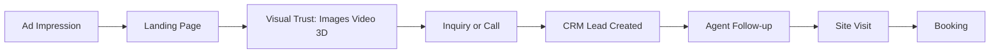

### Visual 2: Solution architecture (executive)
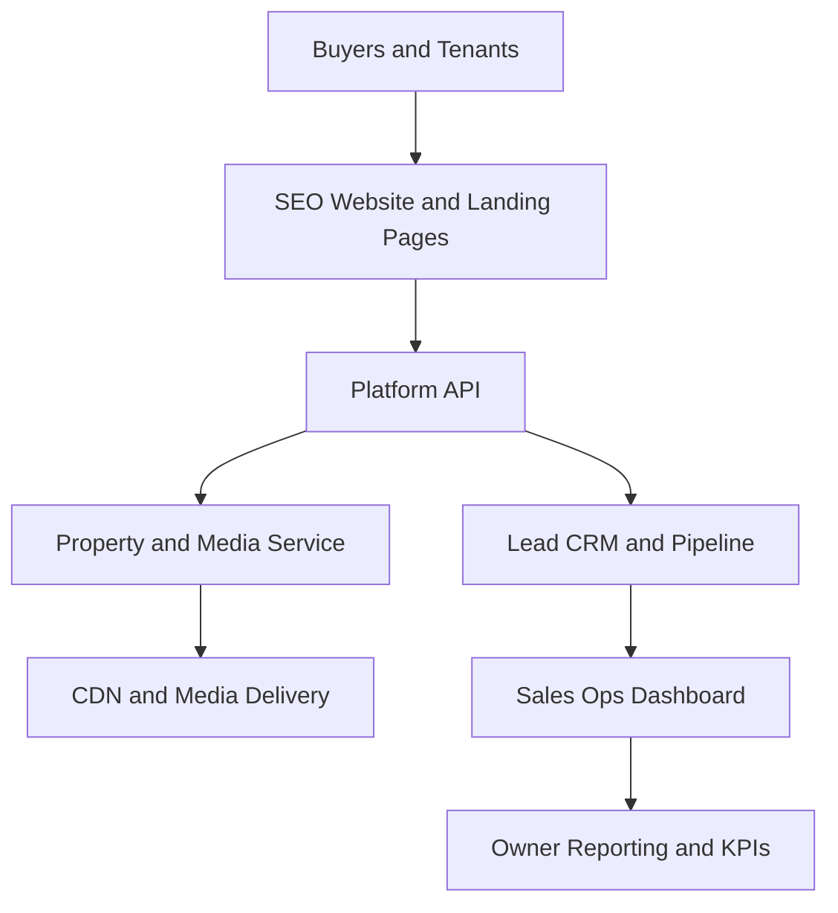

### Visual 3: Delivery timeline (9 weeks)
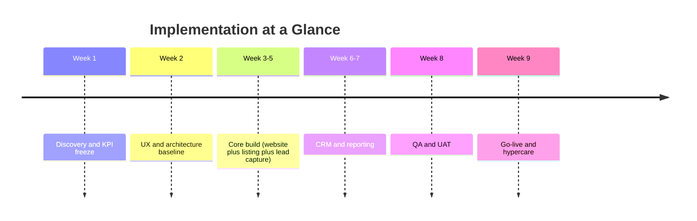

## Document Purpose
This master document consolidates:
- Product Requirements Document (PRD)
- Project Requirements Specification (PRS)
- Implementation Roadmap and Delivery Plan

It is intended as a single source of truth for client review, engineering delivery, QA validation, and project governance.

## Table of Contents
0. 1-Minute Client Snapshot (Visual First)
1. Executive Summary
2. Business Objectives and Outcomes
3. Success Metrics and KPIs
4. Scope Definition (In/Out)
5. Stakeholders, Personas, and User Groups
6. Functional Requirements
7. Business Rules and Validation Rules
8. Non-Functional Requirements
9. Data Model (High-Level)
10. API Surface (MVP)
11. Role-Based Access Matrix
12. Architecture and System Design
13. Visualization and Advertising Experience
14. Key User and System Flows
15. Reporting, QA, and Traceability
16. Delivery Roadmap
17. Delivery Gates and Sign-off Criteria
18. Go-Live, Hypercare, and Governance
19. Risks, Dependencies, and Mitigation
20. Future Phases
21. Final Sign-off Block

---

## 1. Executive Summary
The business currently depends heavily on social posts, direct calls, and manual follow-up. This causes inconsistent lead handling, low visibility across the sales funnel, and limited operational control.

This platform will deliver:
- A conversion-first public website for property discovery and lead capture
- A centralized admin and mini-CRM for lead lifecycle management
- Structured property inventory management with full publishing workflow
- Analytics for decision-making, campaign tracking, and conversion optimization

## 2. Business Objectives and Outcomes
### Primary objectives
- Increase qualified inbound inquiries from digital channels
- Reduce lead leakage via structured follow-up workflows
- Improve trust with verified listing structure and transparent project information
- Digitize inventory and sales operations end-to-end

### Business outcomes
- Faster lead response times
- Better conversion from inquiry to site visit
- Better conversion from site visit to booking
- Better team accountability through audit logs and ownership

## 3. Success Metrics and KPIs
| Metric | Baseline | Target (90 days) | Owner |
|---|---:|---:|---|
| Lead response SLA (first contact) | Manual | <= 10 minutes | Sales Ops |
| Inquiry to contacted rate | Not tracked | >= 85% | CRM Admin |
| Contacted to visit scheduled | Not tracked | >= 35% | Sales Team |
| Visit to booking conversion | Not tracked | >= 12% | Sales Team |
| Bounce rate (SEO landing pages) | Unknown | <= 40% | Growth |
| Organic traffic growth | Low | +30% | Marketing |
| Published listing quality score | Inconsistent | >= 90% complete metadata | Content Ops |

## 4. Scope Definition (In/Out)
### 4.1 In scope (MVP)
- Public website (SEO optimized)
- Property listing and filtering
- Property details page with conversion CTAs
- Lead capture forms and one-click calling actions
- Admin dashboard
- Property management (CRUD + media)
- Lead pipeline management (stages + notes + assignment)
- Basic user and role management
- Audit logs for critical events

### 4.2 Out of scope (MVP)
- Full ERP/accounting integration
- AI recommendation engine
- Native mobile app
- Automated legal document generation

## 5. Stakeholders, Personas, and User Groups
### Stakeholders
- Business owner (chairman and leadership)
- Sales manager
- Sales agents
- Marketing team
- Admin operator

### User groups
- Buyer/tenant (public visitor)
- Property owner/agent (internal or partner contributor)
- Admin and sales operations team

### Personas
#### Persona A: Buyer/Tenant
- Goal: Find trusted property quickly with proper budget and location filters
- Pain points: Fake or outdated listings, slow response from sellers
- Needs: Accurate listing details, instant contact options, transparent pricing

#### Persona B: Sales Agent
- Goal: Convert assigned leads to visits and bookings
- Pain points: Unstructured lead tracking, missed follow-ups
- Needs: Single lead inbox, reminders, notes, stage updates

#### Persona C: Admin/Owner
- Goal: Control quality, monitor performance, optimize conversion
- Pain points: No funnel visibility, fragmented data
- Needs: Dashboard, role-based controls, lead and listing analytics

## 6. Functional Requirements
## 6.1 Public Website and Lead Capture
### FR-101 Search and filter
- Filtering by division, district, area, road, budget range, size range, property type
- Orientation filter including south-facing
- Result count, sort options, pagination metadata

### FR-102 Listing cards
- Show title, location, price, size, featured badge, thumbnail
- Link to canonical property detail URL

### FR-103 Property details
- Media gallery, metadata, map, nearby facilities
- Trust indicators: verification state and last updated timestamp
- CTA cluster: call, WhatsApp, inquiry form

### FR-104 Inquiry form
- Required fields: name, phone
- Optional fields: message, preferred call time
- Source attribution and auto-creation of CRM lead with stage New

### FR-105 SEO pages
- Dynamic metadata per listing and location page
- Structured data markup for listing entities

## 6.2 Admin and CRM Platform
### FR-201 Dashboard
- Listing counts by status
- Lead counts by stage and source
- SLA aging buckets (0-10m, 10-60m, >60m)

### FR-202 Property management
- Create/Edit/Delete/Archive records
- Status transitions with role and validation constraints
- Bulk media upload and ordering

### FR-203 Lead pipeline
- Stages: New -> Attempted -> Contacted -> Visit Scheduled -> Negotiation -> Won/Lost
- Immutable timeline entry on each stage transition
- Owner assignment, notes, follow-up date

### FR-204 Lead assignment
- Manual assignment by manager/admin
- Optional round-robin for incoming unassigned leads

### FR-205 Activity logging
- Track stage changes, assignment, notes, contact attempts
- Chronological lead activity feed

### FR-206 User and role management
- Roles: Super Admin, Admin, Sales Agent, Content Editor, Viewer
- Permission controls by module/action

## 6.3 Notification and Reminder System
### FR-301 Internal reminders
- Generate reminders when follow-up is due
- Display reminder badges on dashboard and lead list

### FR-302 External communication hooks
- Optional adapters for WhatsApp/SMS integrations in future phases

## 6.4 Visualization and Advertising Module
### FR-401 Listing media set (mandatory)
- Minimum 10 high-resolution images per listing (web-optimized variants auto-generated)
- At least 1 walkthrough video for premium listings
- Floor plan image required for flat/apartment inventory
- Thumbnail, card, and hero variants generated automatically

### FR-402 Video experience
- Property detail page supports embedded short-form and long-form video
- Adaptive bitrate streaming for slow/fast networks
- Video poster image and fallback image for unsupported devices
- Track watch events (start, 25%, 50%, 75%, complete) for conversion analytics

### FR-403 360 and 3D experience
- Support 360 panorama viewer for unit interiors
- Support optional glTF/GLB based 3D model viewer for premium projects
- Include interaction analytics: open, rotate, zoom, dwell time
- Provide graceful fallback to static gallery when device/browser is weak

### FR-404 Advertising campaign creatives
- Campaign creative library for Meta, YouTube, TikTok, and Display sizes
- Each creative linked to campaign, audience, and landing page URL
- UTM and source attribution auto-attached to campaign landing links
- Creative approval workflow: Draft -> In Review -> Approved -> Published

### FR-405 Creative QA and compliance
- Validate image dimensions and file size against channel specs
- Validate video duration and aspect ratios (1:1, 4:5, 9:16, 16:9)
- Enforce watermark/logo policy before publish
- Block publish if mandatory legal copy is missing

## 7. Business Rules and Validation Rules
### 7.1 Business Rules
- BR-001: Published listing must include mandatory metadata and at least 5 images
- BR-002: Lead cannot move to Visit Scheduled without first contact
- BR-003: Won requires deal value and close date
- BR-004: Lost requires reason code
- BR-005: Only Admin or Super Admin can archive listing
- BR-006: Only assigned agent or manager can edit lead notes

### 7.2 Validation Rules
#### Phone
- Accept Bangladeshi local format: 01XXXXXXXXX
- Reject invalid length and non-digit payload (except future international mode)

#### Listing
- Price must be positive integer
- Size must be positive number
- Location hierarchy must be complete before publish

## 8. Non-Functional Requirements
- NFR-101 Performance: Core pages <= 2s on standard 4G
- NFR-102 UX performance: LCP <= 2.5s on primary landing pages
- NFR-103 Security: JWT auth, RBAC, validation, sanitization, rate limiting
- NFR-104 Scalability: Modular backend and indexed search-critical queries
- NFR-105 SEO: SSR/ISR, dynamic metadata, structured data, sitemap, robots
- NFR-106 Reliability: 99.9% monthly availability target
- NFR-107 API performance: p95 <= 350ms under normal load for core endpoints
- NFR-108 Operations: daily backup, 30-day retention, centralized observability
- NFR-109 Media performance: hero media start render <= 1.5s on broadband, <= 2.5s on 4G
- NFR-110 Media delivery: CDN-backed image/video with signed URLs for protected assets
- NFR-111 3D fallback: non-WebGL clients must receive static media without broken UI

## 9. Data Model (High-Level)
### Property entity
```json
{
  "id": "",
  "title": "",
  "slug": "",
  "price": 0,
  "location": {
    "division": "",
    "district": "",
    "area": "",
    "road": ""
  },
  "type": "flat|land|commercial",
  "sizeSqft": 0,
  "facing": "south|north|east|west",
  "amenities": [],
  "media": [],
  "status": "draft|published|reserved|sold|rented|archived",
  "createdAt": "",
  "updatedAt": ""
}
```

### Lead entity
```json
{
  "id": "",
  "propertyId": "",
  "name": "",
  "phone": "",
  "source": "website|facebook|whatsapp|direct",
  "stage": "new|attempted|contacted|visit_scheduled|negotiation|won|lost",
  "assignedAgentId": "",
  "notes": [],
  "lastActivityAt": "",
  "createdAt": ""
}
```

## 10. API Surface (MVP)
### Property APIs
- GET /api/properties
- GET /api/properties/:id
- POST /api/admin/properties
- PATCH /api/admin/properties/:id
- PATCH /api/admin/properties/:id/status

### Lead APIs
- POST /api/leads
- GET /api/admin/leads
- PATCH /api/admin/leads/:id
- PATCH /api/admin/leads/:id/stage
- PATCH /api/admin/leads/:id/assign

## 11. Role-Based Access Matrix
| Module | Super Admin | Admin | Sales Agent | Content Editor | Viewer |
|---|---|---|---|---|---|
| Listings Create/Edit | Yes | Yes | No | Yes | No |
| Listings Publish/Archive | Yes | Yes | No | Limited | No |
| Leads View All | Yes | Yes | Limited | No | Read-only |
| Leads Assign | Yes | Yes | No | No | No |
| Leads Stage Update | Yes | Yes | Assigned only | No | No |
| Reports Export | Yes | Yes | Limited | No | No |
| User Management | Yes | Yes | No | No | No |

## 12. Architecture and System Design
### 12.1 High-level architecture
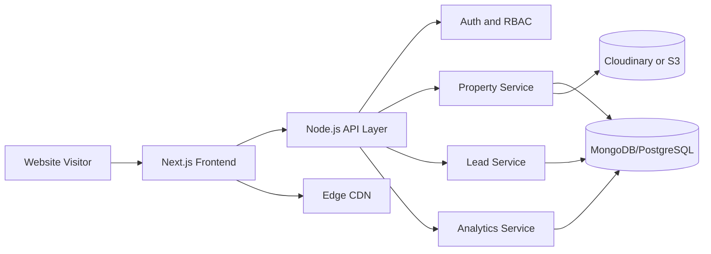

### 12.2 Context view
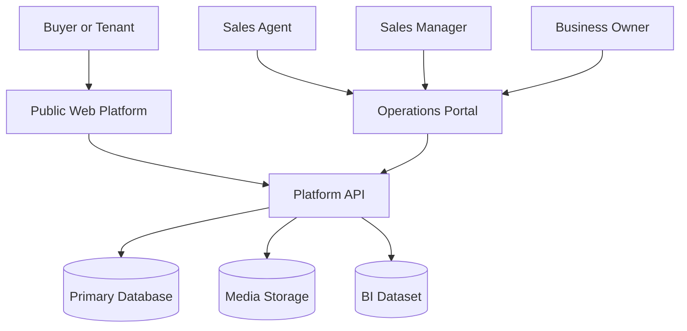

### 12.3 Container-level view
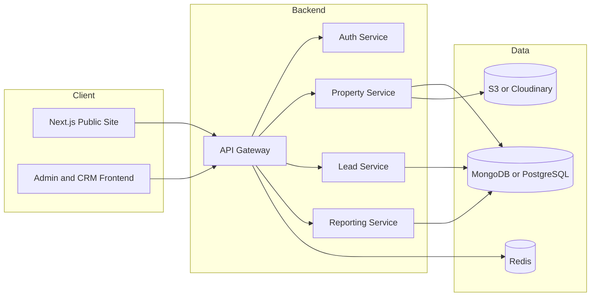

### 12.4 Media and advertising asset architecture
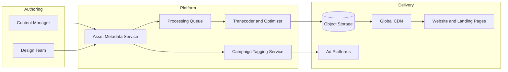

## 13. Visualization and Advertising Experience
### 13.1 User-facing visualization strategy
- Listing pages prioritize visual trust with image-first hero sections
- Video tours appear above fold for premium inventory
- 3D and 360 tours are enabled when assets exist and device capability allows
- Nearby infrastructure visualization includes map overlays (school, mosque, hospital, market)

### 13.2 Advertisement content strategy
- Primary channels: Facebook/Instagram, YouTube, TikTok, Google Display
- Campaign types: awareness, lead capture, retargeting, inventory-specific offers
- Each campaign has dedicated landing pages with matched creative intent
- All ad clicks map to lead source and campaign ID in CRM

### 13.3 Creative asset specification matrix
| Asset Type | Minimum Spec | Preferred Spec | Usage |
|---|---|---|---|
| Property image | 1600x900 JPG/WebP | 2400x1350 WebP/AVIF | Listing hero and gallery |
| Floor plan | 1400x1400 PNG | 2000x2000 PNG/SVG | Detail page and brochure |
| Short ad video | 1080x1920, 15-30s | 1080x1920, 20-45s | Reels/shorts ads |
| Long video walkthrough | 1920x1080, 60-180s | 4K master + 1080p renditions | Listing detail + YouTube |
| 360 panorama | Equirectangular 4K | Equirectangular 8K | Interactive room view |
| 3D model | glTF/GLB <= 25MB | glTF/GLB <= 40MB + LOD | Premium project showcase |

### 13.4 Visual conversion funnel
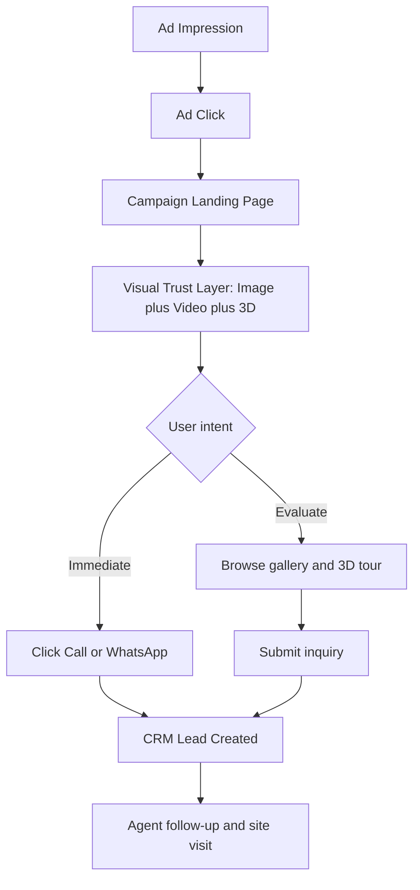

### 13.5 Creative production and approval flow
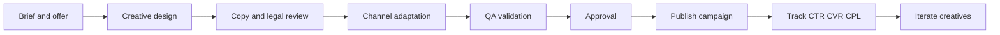

## 14. Key User and System Flows
### 13.1 Lead generation flow
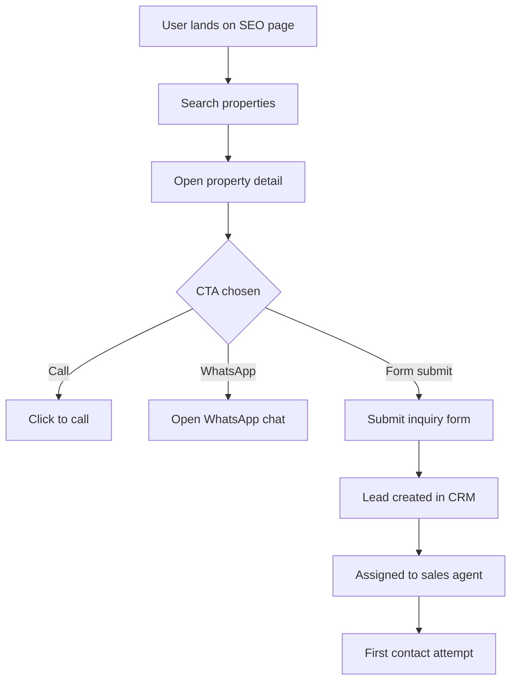

### 13.2 Lead pipeline flow
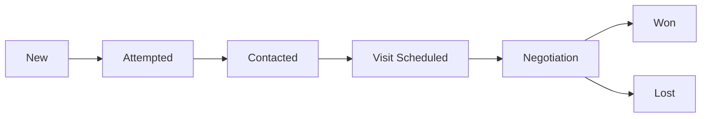

### 13.3 Inquiry submission sequence
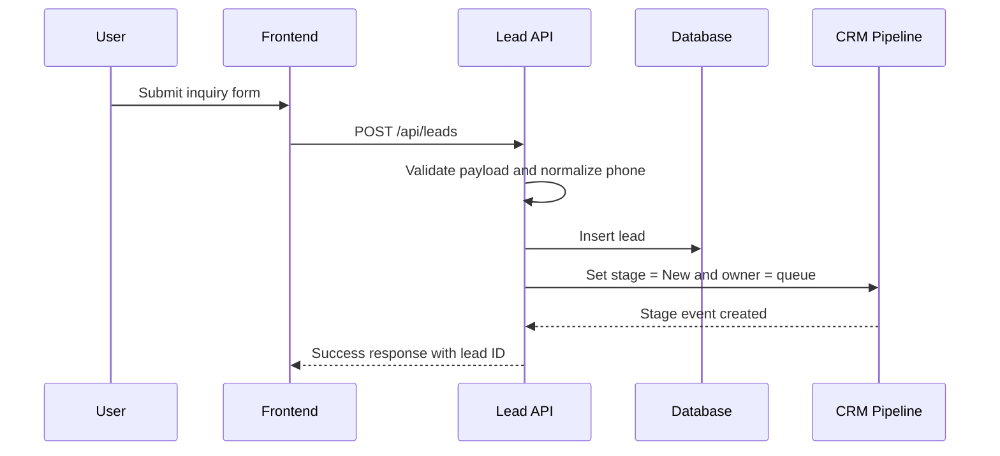

## 15. Reporting, QA, and Traceability
### Reporting requirements
- Daily lead report by source and stage
- Agent performance (contact SLA and conversion)
- Listing performance (views, contacts, contribution)

### Data retention
- Lead timeline and notes retained minimum 24 months
- Admin-sensitive audit logs retained minimum 24 months

### QA strategy
- Unit tests for services and validators
- Integration tests for API workflows
- End-to-end tests for lead capture and stage transitions

### Critical acceptance tests
- Lead creation from public page
- Stage transition guard checks
- Role restriction checks
- Listing publish validation checks

### Requirement traceability matrix (sample)
| Requirement ID | Module | Test Case ID | Priority |
|---|---|---|---|
| FR-104 | Inquiry form | TC-LEAD-001 | High |
| FR-203 | Lead pipeline | TC-LEAD-012 | High |
| FR-206 | RBAC | TC-AUTH-007 | High |
| BR-002 | Stage guard | TC-LEAD-018 | High |
| NFR-107 | API performance | TC-PERF-004 | Medium |

## 16. Delivery Roadmap
### 16.1 Delivery strategy
- Agile delivery in 2-week sprints
- MVP-first release with iterative hardening
- Weekly steering review with client

### 16.2 Phase plan
| Phase | Duration | Objectives | Deliverables |
|---|---|---|---|
| Phase 0 Discovery and Alignment | Week 1 | Scope, KPI, architecture finalization | Approved PRD, risk register, design inputs |
| Phase 1 UX and Technical Foundation | Week 2 | UX and technical bootstrap | Figma flows, API contract draft, CI/CD baseline |
| Phase 2 Core Build | Week 3-5 | Public site, property module, lead capture | Search, listing detail, inquiry API, listing CRUD |
| Phase 3 CRM and Ops Maturity | Week 6-7 | Lead pipeline, assignment, reporting | Stages, notes, activity timeline, SLA dashboard |
| Phase 4 Hardening and UAT | Week 8 | QA, security, optimization | UAT report, closure report, release candidate |
| Phase 5 Go-Live and Hypercare | Week 9 | Production launch and stabilization | Deployment, runbook, support |

### 16.3 Timeline view
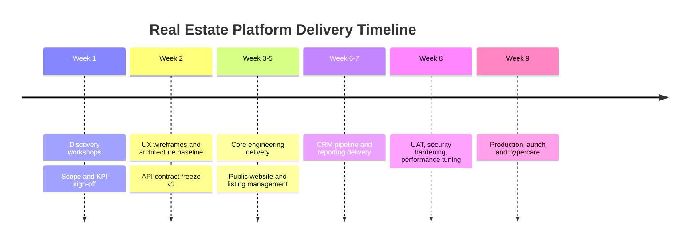

### 16.4 Gantt view
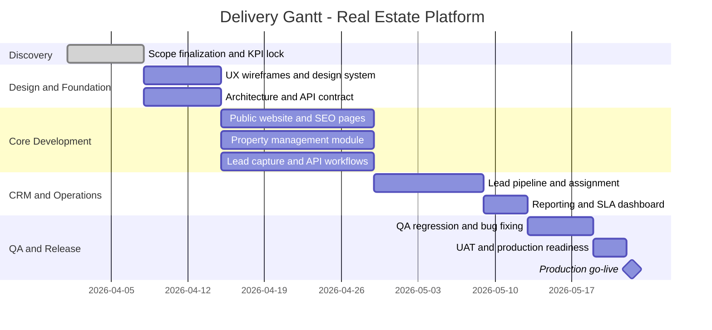

## 17. Delivery Gates and Sign-off Criteria
### Gate 1: Discovery complete
- Approved PRD
- Signed scope and priority matrix

### Gate 2: Build readiness
- Finalized API contracts
- Approved UX flows and high-fidelity pages

### Gate 3: MVP functional complete
- All High priority requirements delivered
- Critical defect count = 0

### Gate 4: UAT pass
- Client-approved UAT report
- Go-live checklist complete

## 18. Go-Live, Hypercare, and Governance
### Go-live checklist
- Production environment configured
- SSL and domain routing validated
- Backup and restore test completed
- Monitoring dashboards active
- Error alert channels configured
- Rollback strategy documented

### Communication cadence
- Daily: internal engineering stand-up
- Weekly: client progress review
- Biweekly: sprint demo and acceptance
- On-demand: risk escalation sync

### RACI matrix (simplified)
| Activity | Client Owner | Product Lead | Engineering | QA | DevOps |
|---|---|---|---|---|---|
| Requirement sign-off | A | R | C | C | C |
| UX and flow approval | A | R | C | C | I |
| Feature development | I | C | R | C | C |
| Testing and validation | I | C | C | R | C |
| Production release | C | C | C | C | R |

### Post-launch support
- Hypercare duration: 2 to 4 weeks
- Critical issue response SLA: within 1 hour
- Scope: bug fixes, minor optimization, monitoring stabilization

## 19. Risks, Dependencies, and Mitigation
### Dependencies
| Dependency | Impact if delayed | Mitigation |
|---|---|---|
| Client branding assets | Medium | Temporary placeholders and tokens |
| Listing dataset quality | High | Import template and validation gate |
| Hosting and domain access | High | Infra access request in Week 1 |
| Third-party API keys | Medium | Stubs and feature flags |

### Risk register
| Risk | Probability | Impact | Mitigation |
|---|---|---|---|
| Poor listing data quality | Medium | High | Publish checklist and mandatory validation |
| Slow lead follow-up | Medium | High | SLA dashboard and assignment alerts |
| Traffic spikes | Low | Medium | CDN and scalable infrastructure |
| Spam lead submissions | Medium | Medium | Rate limiting and phone validation |

### Risk handling flow
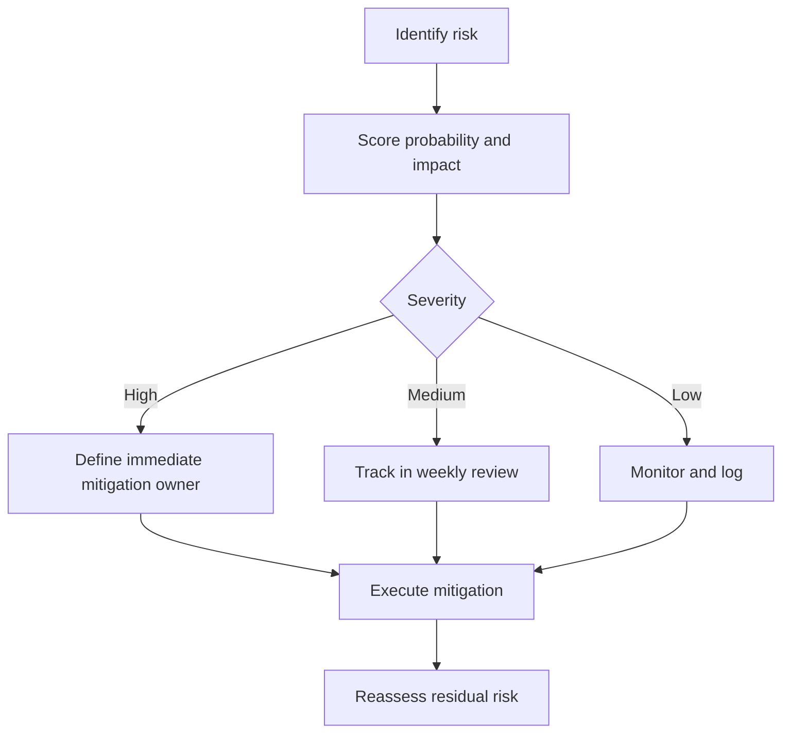

## 20. Future Phases
- Mobile app (React Native)
- Payment integration (bKash, Nagad)
- Facebook lead webhook automation
- WhatsApp/SMS automation integration
- AI-assisted property recommendation and lead scoring
- Appointment scheduling calendar and reminders

## 21. Final Sign-off Block
- Client representative: ______________________
- Delivery lead: _____________________________
- Date: _____________________________________
