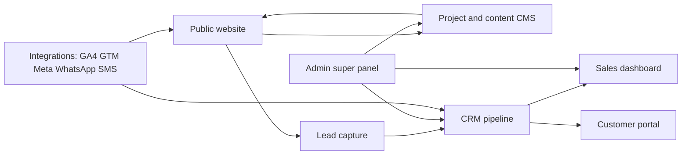
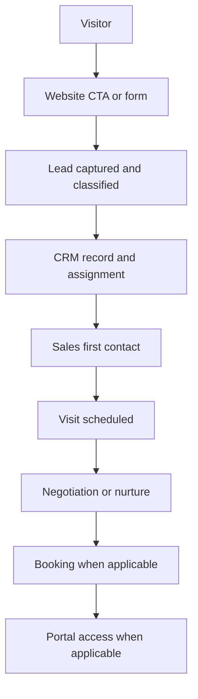
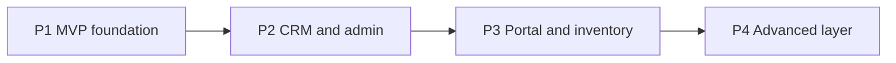

# Product Requirements Document — Master Scope (Client Edition)

## Advance Landmark Limited — Enterprise Real Estate Digital Platform Ecosystem

| Field | Value |
| --- | --- |
| **Version** | 4.0 (Client Edition) |
| **Date** | April 2026 |
| **Confidentiality** | Confidential |
| **Prepared for** | Advance Landmark Limited |
| **Attention** | Chairman, Fahad Hossain (ফাহাদ হোসেন) |
| **Document purpose** | Single master scope for product delivery, growth operations, and SLA-backed technical support |

---

## Client and document control

| Field | Value |
| --- | --- |
| **Client organization** | Advance Landmark Limited |
| **Registered address** | Plot 268, Road 12, Savar DOHS, Savar, Dhaka |
| **Contact** | 01711729009 |
| **Document title** | Enterprise Real Estate Digital Platform Ecosystem — Master Scope |
| **Owner** | Advance Landmark Limited |
| **Scope type** | End-to-end platform, growth operations, support |
| **Validity** | Effective after formal client approval; changes via agreed change request |

---

## How to read this document

1. **Domains (A–F)** group related capabilities: public site, leads and portal, CRM and inventory, marketing integrations, growth services, post-launch support.
2. **Modules** (for example A1, B3) are the units of scope you can approve, track in delivery, and accept in UAT.
3. Each module table lists **objective**, **key capabilities**, **deliverables**, **KPI impact**, and **acceptance criteria** (what “done” means for the client).
4. **Phases (P1–P4)** describe rollout over time; not everything ships in the first release.
5. **Technical detail** for engineering (numbered FR/NFR requirements) lives in [02-Project-Requirements-Specification.md](./02-Project-Requirements-Specification.md).
6. **Benchmark URLs** in the appendix are for alignment on patterns; final design and code remain original to Advance Landmark.

### Glossary

| Term | Meaning |
| --- | --- |
| **CMS** | Content management system (publish projects, pages, media). |
| **CRM** | Customer relationship management (lead pipeline, tasks, assignment). |
| **NRB** | Non-resident Bangladeshis; overseas buyers. |
| **SLA** | Service level agreement (response time commitments for support). |
| **GA4 / GTM** | Google Analytics 4 / Google Tag Manager. |
| **UAT** | User acceptance testing before go-live. |
| **KPI** | Key performance indicator. |

---

## 1. Executive summary

Advance Landmark Limited needs a **full digital business platform**, not only a brochure website. This master scope covers:

- **Trust and discovery** on the public website (projects, categories, NRB and investment storylines).
- **Lead capture and quality** (forms, channels, scoring, deduplication).
- **Sales operations** (CRM pipeline, assignment, follow-up, reporting).
- **Customer transparency** (portal: profile, booking and payment visibility, documents, tickets).
- **Marketing and data** (analytics, pixels, messaging integrations, SEO foundation).
- **Ongoing growth execution** (creative, video, content, social, paid campaigns — as retained services).
- **Stability after launch** (SLA, maintenance, monitoring, backups).

### 1.1 Delivery tracks

| Track | What it includes |
| --- | --- |
| **Product engineering** | Website, CMS, CRM, customer portal, admin, integrations. |
| **Growth operations** | Creative, content, social, SEO execution, paid campaign operations. |

### 1.2 Strategic outcomes

1. Stronger **trust and authority** with buyers, investors, and landowners.
2. Better **lead quality** and fewer delays in follow-up.
3. Higher **visit-to-booking** conversion through structured sales and inventory discipline.
4. **Measurable growth** via SEO, campaigns, and analytics.
5. **Business continuity** through SLA-governed support and monitoring.

---

## 2. Scope map (domains A–F)

| Domain | Area | Primary business value |
| --- | --- | --- |
| **A** | Public website and brand experience | Trust, project discovery, conversion |
| **B** | Lead engine and customer portal | Enquiry handling and customer self-service |
| **C** | CRM, admin, sales, inventory | Pipeline control and operational visibility |
| **D** | Marketing and channel integrations | Attribution, remarketing, SEO baseline |
| **E** | Technical growth services | Continuous campaign and content execution |
| **F** | Post-launch support and SLA | Reliability, security, optimization |

---

## 3. Master system view (integrated ecosystem)

The following diagram shows how the main parts of the ecosystem connect. Detailed technical architecture is out of scope for this client document; engineering references the PRS and roadmap.

---

## 4. Lead journey (high level)

From first touch on the website through sales follow-up (simplified).

---

## 5. Module-by-module scope

Each module uses the same columns: **Objective**, **Key capabilities**, **Deliverables**, **KPI impact**, **Acceptance criteria**.

### Domain A — Public website and brand experience

#### A1. Homepage conversion engine

| Item | Details |
| --- | --- |
| Objective | Premium first impression and immediate enquiry intent |
| Key capabilities | Hero, trust metrics, featured projects, CTA cluster, chairman message preview |
| Deliverables | Responsive homepage, editable sections in CMS, CTA event tracking |
| KPI impact | Engagement and enquiry initiation rate |
| Acceptance criteria | Fast load on mobile and desktop; primary CTAs visible without scrolling past the fold on standard viewports; content editable by authorized admin |

#### A2. About, legacy, and corporate trust

| Item | Details |
| --- | --- |
| Objective | Confidence through transparent company narrative |
| Key capabilities | Company profile, leadership message, milestones, certifications, compliance cards |
| Deliverables | About page suite with structured content blocks |
| KPI impact | Trust-related engagement and lower bounce |
| Acceptance criteria | Content manageable via CMS; compliance and legal visibility clear to visitors |

#### A3. Project listing discovery

| Item | Details |
| --- | --- |
| Objective | Help users find relevant projects quickly |
| Key capabilities | Filters (status, location, type, budget), project cards, quick contact CTA |
| Deliverables | Searchable project listing |
| KPI impact | Project page visits and shortlist or detail clicks |
| Acceptance criteria | Filter accuracy; usable on mobile; no dead-end navigation |

#### A4. Project detail conversion

| Item | Details |
| --- | --- |
| Objective | Convert project interest into qualified leads |
| Key capabilities | Gallery, floor plans, amenities, map, brochure download, schedule visit |
| Deliverables | Project detail template integrated with lead capture |
| KPI impact | Brochure downloads, visit bookings, enquiries |
| Acceptance criteria | Complete information layout; working lead forms; clear CTA hierarchy |

#### A5. Property category journeys

| Item | Details |
| --- | --- |
| Objective | Segment journeys by buying intent |
| Key capabilities | Residential, commercial, land/plot, township category pages |
| Deliverables | Category landing templates linked to listings |
| KPI impact | Time on site and category-specific lead quality |
| Acceptance criteria | Clear navigation and conversion path per segment |

#### A6. Investment insights and ROI content

| Item | Details |
| --- | --- |
| Objective | Support investor and NRB decision-makers |
| Key capabilities | Market insights, location growth narrative, investment articles |
| Deliverables | Investment-focused pages and insight library |
| KPI impact | Investor lead volume and content engagement |
| Acceptance criteria | Structured categories; SEO-friendly headings and metadata |

#### A7. NRB and overseas buyer pathway

| Item | Details |
| --- | --- |
| Objective | Reduce friction for remote buyers |
| Key capabilities | Dedicated NRB landing, remote consultation flow, document guidance |
| Deliverables | NRB funnel pages with dedicated CTA routing |
| KPI impact | NRB enquiries and consultation bookings |
| Acceptance criteria | Clear step-by-step communication for overseas buyers |

#### A8. Blog, media, and knowledge hub

| Item | Details |
| --- | --- |
| Objective | Authority and SEO support |
| Key capabilities | Categories, media updates, share-ready article layout |
| Deliverables | Blog CMS templates and publication workflow |
| KPI impact | Organic sessions and returning users |
| Acceptance criteria | Publishing workflow and SEO metadata controls for editors |

#### A9. Contact and channel routing

| Item | Details |
| --- | --- |
| Objective | Frictionless communication |
| Key capabilities | Forms, department routing, hotline, WhatsApp, branch map |
| Deliverables | Multi-channel contact experience |
| KPI impact | Contact conversion and response speed |
| Acceptance criteria | Correct routing; tap-to-call on mobile; accurate published contacts |

#### A10. UX performance and conversion enhancers

| Item | Details |
| --- | --- |
| Objective | Speed and consistent conversion |
| Key capabilities | Sticky CTA, lazy loading, prioritized UX refinements |
| Deliverables | Performance and UX enhancement layer |
| KPI impact | Lower bounce; higher form completion |
| Acceptance criteria | Meets agreed performance benchmark documented at kickoff |

---

### Domain B — Lead engine and customer portal

#### B1. Multi-source lead capture

| Item | Details |
| --- | --- |
| Objective | One system for all lead sources |
| Key capabilities | Form, call tracking hooks, WhatsApp, brochure, campaign intake |
| Deliverables | Unified lead intake with source tagging |
| KPI impact | Accurate volume and source reporting |
| Acceptance criteria | Mandatory fields validated; source captured for each lead type agreed in UAT |

#### B2. Lead qualification and auto-acknowledgement

| Item | Details |
| --- | --- |
| Objective | Better early-stage handling |
| Key capabilities | Hot/warm/cold scoring, auto SMS/email acknowledgement |
| Deliverables | Scoring rules and acknowledgement workflow |
| KPI impact | First-response speed and engagement |
| Acceptance criteria | Scores apply per rules; acknowledgement sends on successful submit |

#### B3. Duplicate prevention and data hygiene

| Item | Details |
| --- | --- |
| Objective | Clean pipeline data |
| Key capabilities | Duplicate checks by phone/email, merge recommendations |
| Deliverables | Deduplication workflow |
| KPI impact | Reliable CRM and conversion reporting |
| Acceptance criteria | Threshold and merge behavior validated in UAT |

#### B4. Customer portal — access and profile

| Item | Details |
| --- | --- |
| Objective | Secure self-service |
| Key capabilities | Login, profile updates, preferences, password controls |
| Deliverables | Customer account module |
| KPI impact | Lower manual support load |
| Acceptance criteria | Secure login; profile update succeeds for authorized users |

#### B5. Booking, payment, and document timeline

| Item | Details |
| --- | --- |
| Objective | Transparent transactions |
| Key capabilities | Booking status, installments, payment records, document vault |
| Deliverables | Transaction timeline dashboard |
| KPI impact | Customer confidence; fewer status calls |
| Acceptance criteria | Data shown matches agreed back-office source of truth in UAT |

#### B6. Support tickets and communication log

| Item | Details |
| --- | --- |
| Objective | Traceable customer service |
| Key capabilities | Ticket creation, status updates, history |
| Deliverables | Portal support center |
| KPI impact | Faster resolution and auditability |
| Acceptance criteria | Ticket lifecycle visible to customer and internal roles per policy |

---

### Domain C — CRM, admin, sales, and inventory

#### C1. CRM pipeline management

| Item | Details |
| --- | --- |
| Objective | Control lifecycle from enquiry to closure |
| Key capabilities | Stages, transition rules, lead board |
| Deliverables | Pipeline module with reporting |
| KPI impact | Pipeline velocity and conversion visibility |
| Acceptance criteria | Stage changes audited; invalid transitions blocked |

#### C2. Lead assignment and workload logic

| Item | Details |
| --- | --- |
| Objective | Fair and strategic distribution |
| Key capabilities | Auto/manual assignment by project, zone, or capacity |
| Deliverables | Configurable assignment rules |
| KPI impact | Response time and productivity |
| Acceptance criteria | UAT proves routing matches configured rules |

#### C3. Follow-up scheduler and task control

| Item | Details |
| --- | --- |
| Objective | Reduce missed follow-ups |
| Key capabilities | Reminders, overdue alerts, daily agenda |
| Deliverables | Scheduling and task views |
| KPI impact | Follow-up completion rate |
| Acceptance criteria | Notifications trigger per configuration |

#### C4. Activity timeline and sales notes

| Item | Details |
| --- | --- |
| Objective | Single place for accountability |
| Key capabilities | Calls, meetings, notes, timestamps |
| Deliverables | Unified timeline per lead |
| KPI impact | Handover quality and audits |
| Acceptance criteria | Chronological integrity; edit policies enforced |

#### C5. Conversion and sales performance analytics

| Item | Details |
| --- | --- |
| Objective | Management-level insight |
| Key capabilities | Stage ratios, source performance, team reports |
| Deliverables | Dashboards and exports |
| KPI impact | Data-backed decisions |
| Acceptance criteria | Report totals reconcile to CRM in UAT sample |

#### C6. Project and content administration

| Item | Details |
| --- | --- |
| Objective | Non-technical control of public content |
| Key capabilities | Project CRUD, publish states, media library, page management |
| Deliverables | Admin CMS with roles |
| KPI impact | Faster updates and governance |
| Acceptance criteria | Permissions enforce create/edit/publish per role |

#### C7. Inventory and pricing governance

| Item | Details |
| --- | --- |
| Objective | Accurate availability and pricing |
| Key capabilities | Availability matrix, unit specs, price by type/floor/view |
| Deliverables | Inventory manager |
| KPI impact | Fewer booking conflicts |
| Acceptance criteria | Status changes reflect in sales workflow in near real time |

#### C8. Booking lock and approval workflow

| Item | Details |
| --- | --- |
| Objective | Protect inventory during negotiation |
| Key capabilities | Temporary lock, expiry, discount approval hierarchy |
| Deliverables | Booking governance workflow |
| KPI impact | Controlled commercial approvals |
| Acceptance criteria | Locks and approvals auditable and enforceable |

---

### Domain D — Marketing and channel integrations

#### D1. Analytics foundation (GA4 + GTM)

| Item | Details |
| --- | --- |
| Objective | Reliable behavior and conversion measurement |
| Key capabilities | Event schema, goals, funnel mapping |
| Deliverables | Implementation and validation report |
| KPI impact | Trustworthy performance data |
| Acceptance criteria | Key events verified in analytics property |

#### D2. Pixel and remarketing setup

| Item | Details |
| --- | --- |
| Objective | Efficient paid media targeting |
| Key capabilities | Meta Pixel, audience events, conversion mapping |
| Deliverables | Remarketing-ready tracking |
| KPI impact | Audience quality and campaign ROI |
| Acceptance criteria | Pixel and audiences verified in test events |

#### D3. WhatsApp and SMS integration

| Item | Details |
| --- | --- |
| Objective | Faster confirmations and outreach |
| Key capabilities | Triggers, templates, routing |
| Deliverables | Integrated messaging workflow |
| KPI impact | Speed and lower drop-off |
| Acceptance criteria | Messages deliver under agreed test scenarios |

#### D4. SEO technical and content framework

| Item | Details |
| --- | --- |
| Objective | Long-term organic visibility |
| Key capabilities | Technical baseline, metadata model, schema, indexing controls |
| Deliverables | SEO foundation and reporting framework |
| KPI impact | Organic traffic and keyword visibility |
| Acceptance criteria | Audit checklist signed off in UAT |

---

### Domain E — Integrated technical growth services

#### E1. Creative design operations

| Item | Details |
| --- | --- |
| Objective | Consistent campaign visuals |
| Key capabilities | Brand templates, ad and social creatives |
| Deliverables | Weekly/monthly creative sets per plan |
| KPI impact | Engagement quality |
| Acceptance criteria | Brand guideline adherence and approval cycle |

#### E2. Video production and editing support

| Item | Details |
| --- | --- |
| Objective | Stronger storytelling and ad performance |
| Key capabilities | Reels, testimonials, cutdowns, subtitles |
| Deliverables | Video pipeline by campaign cycle |
| KPI impact | Watch-through and engagement |
| Acceptance criteria | Delivery per agreed calendar |

#### E3. Content and copy operations

| Item | Details |
| --- | --- |
| Objective | Clarity and conversion |
| Key capabilities | Website, blog, ad copy; bilingual as agreed |
| Deliverables | Monthly copy plan |
| KPI impact | CTR and content retention |
| Acceptance criteria | Editorial approval and tone consistency |

#### E4. Social media operations

| Item | Details |
| --- | --- |
| Objective | Regular presence and response |
| Key capabilities | Calendar, publishing, moderation |
| Deliverables | Weekly activity and monthly report |
| KPI impact | Reach and inbound enquiries |
| Acceptance criteria | Cadence and moderation SLA as contracted |

#### E5. Paid campaign operations

| Item | Details |
| --- | --- |
| Objective | Lead cost and quality optimization |
| Key capabilities | Setup, testing, optimization, reporting |
| Deliverables | Campaign management workflow |
| KPI impact | CPL and qualified leads |
| Acceptance criteria | Monthly optimization log and summary |

#### E6. Monthly growth governance

| Item | Details |
| --- | --- |
| Objective | Align execution with business goals |
| Key capabilities | Planning sprint, mid-cycle review, monthly insights |
| Deliverables | Monthly action plan and performance deck |
| KPI impact | Strategic alignment |
| Acceptance criteria | Approved plan and completed review cycle |

---

### Domain F — Post-launch support and SLA

#### F1. Incident management and SLA desk

| Item | Details |
| --- | --- |
| Objective | Timely support |
| Key capabilities | Priority matrix, ownership, response tracking |
| Deliverables | Formal incident response |
| KPI impact | Downtime and recovery time |
| Acceptance criteria | Response times per SLA table below |

#### F2. Security, performance, and dependency maintenance

| Item | Details |
| --- | --- |
| Objective | Stable secure platform |
| Key capabilities | Patching, updates, health checks |
| Deliverables | Monthly maintenance cycle and change log |
| KPI impact | Lower technical risk |
| Acceptance criteria | Checklist completion and traceable logs |

#### F3. Backup, monitoring, and recovery readiness

| Item | Details |
| --- | --- |
| Objective | Business continuity |
| Key capabilities | Backups, uptime monitoring, recovery readiness |
| Deliverables | Operational monitoring baseline |
| KPI impact | Service continuity |
| Acceptance criteria | Backup verification and alerting validated |

#### SLA matrix (illustrative — finalize in support agreement)

| Priority | Incident type | Response SLA | Target resolution approach |
| --- | --- | --- | --- |
| P1 Critical | Full outage, major security or data event | Under 2 hours | Immediate triage and containment |
| P2 High | Core feature unavailable, major workflow block | Under 8 hours | Priority fix or workaround |
| P3 Medium | Defect with workaround | Under 24 hours | Scheduled patch |
| P4 Low | Minor issue or enhancement | Under 72 hours | Planned maintenance window |

---

## 6. Phased delivery roadmap (P1–P4)

Higher phases build on earlier ones. Exact week-by-week execution is in [03-Implementation-Roadmap-and-Delivery-Plan.md](./03-Implementation-Roadmap-and-Delivery-Plan.md).

| Phase | Name | Duration (indicative) | Core scope |
| --- | --- | --- | --- |
| **P1** | MVP website foundation | 8–10 weeks | Homepage, trust pages, project listing/detail, lead capture, SEO baseline, CMS-ready foundation |
| **P2** | CRM and admin foundation | 5–6 weeks | CRM pipeline, assignment, admin CMS, reporting baseline |
| **P3** | Customer and inventory expansion | 6–8 weeks | Customer portal, booking/payment visibility, inventory and locks |
| **P4** | Advanced automation layer | 6–8 weeks | Deeper analytics, automation, premium experiences per change-approved backlog |

---

## 7. Technical appendix (summary only)

| Layer | Recommendation |
| --- | --- |
| Frontend | Next.js, React |
| Backend | Node.js (NestJS or Express) |
| Database | PostgreSQL |
| Cache and jobs | Redis, queue processing |
| Media storage | S3-compatible object storage |
| Authentication | JWT + OTP where required |
| Payments | SSLCommerz, bKash (when enabled) |
| SMS | Local gateway (client-provided if required) |
| Hosting | Cloud provider (for example AWS) |
| CI/CD | GitHub Actions |
| Monitoring and logs | Cloud monitoring and centralized logs |

Non-functional requirements and API-level detail: [02-Project-Requirements-Specification.md](./02-Project-Requirements-Specification.md).

---

## 8. Governance and RACI

| Workstream | Delivery team | Client SPOC | Chairman office |
| --- | --- | --- | --- |
| Product and module delivery | Responsible | Consulted | Informed |
| Brand and content approvals | Consulted | Responsible | Accountable |
| UAT and acceptance sign-off | Consulted | Responsible | Accountable |
| Monthly growth planning | Responsible | Consulted | Informed |
| Change request approvals | Consulted | Responsible | Accountable |

Delivery model: agile sprints, weekly review, UAT gate per phase, written change requests for out-of-scope items.

---

## 9. In scope and out of scope

### Included

1. Implementation of approved modules across Domains A–F as contracted per phase.
2. CRM, portal, admin, integrations, and analytics **foundation** as specified.
3. Growth support **operating model** where retained (Domain E).
4. SLA-based post-launch support for agreed duration (Domain F).

### Excluded unless approved by change request

1. Third-party **media spend** (ad budget).
2. Legal, tax, or regulatory **advisory** beyond software process support.
3. **New enterprise modules** not listed in this document.
4. Hosting, domain, SMS, and email **vendor costs** unless otherwise agreed in writing.

---

## 10. Module count summary

| Domain | Description | Modules |
| --- | --- | ---: |
| A | Public website and experience | 10 |
| B | Lead engine and customer portal | 6 |
| C | CRM, admin, sales, inventory | 8 |
| D | Marketing and integrations | 4 |
| E | Technical growth services | 6 |
| F | Post-launch and SLA | 3 |
| **Total** | **Unified ecosystem** | **37** |

---

## 11. Sign-off

| Role | Name | Date | Signature |
| --- | --- | --- | --- |
| Client representative | | | |
| Chairman | | | |
| Delivery partner | | | |

---

## Appendix A — Benchmark reference URLs (design alignment)

Use these URLs to discuss **patterns** (trust blocks, project grids, CTAs). Final creative output is **original** for Advance Landmark Limited.

Optional: place exported screenshots in [references/benchmarks/](./references/benchmarks/) and reference them from a client PDF pack.

| # | Competitor / reference | URL | Suggested focus |
| --- | --- | --- | --- |
| 1 | BTI | https://btibd.com/ | Homepage trust and premium hero |
| 2 | Swadesh Properties | https://www.swadeshproperties.com/ | Project listing and filters |
| 3 | Assure Group | https://www.assuregroupbd.com/ | Project detail and trust content |
| 4 | Shanta Holdings | https://shantaholdings.com/ | Brand-led premium narrative |
| 5 | Rangs Properties | https://rangsproperties.com/ | Portfolio-style presentation |
| 6 | ABC Real Estate | https://abcreal.com.bd/ | Corporate clarity and contact |
| 7 | Concord Real Estate | https://concordrealestatebd.com/ | Category and collection UX |
| 8 | Sheltech | https://sheltech-bd.com/ | Content and media hub patterns |
| 9 | Suvastu Properties | https://suvastuproperties.com/ | Listing and content mix |
| 10 | Bashundhara Housing | https://www.bashundharahousing.com/ | Buyer journey and process pages |
| 11 | Navana Real Estate | https://navanarealestate.com/ | NRB / corporate buyer cues |
| 12 | AMLDL | https://www.amldlbd.com/ | Local developer digital patterns |

---

**Advance Landmark Limited — PRD Master Scope v4.0 (Client Edition) — Confidential**  
Prepared for Fahad Hossain, Chairman, Advance Landmark Limited.
